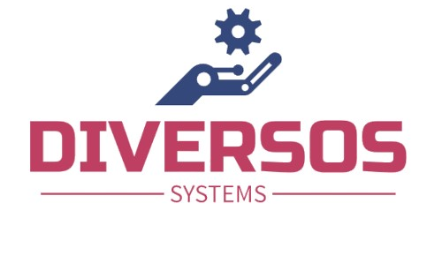

# ISE-IC-DIVERSOS

## Diversos Systems Project

Welcome to the repository for the INGENIA Systems Engineering Challenge. This project centers around the development of an autonomous system capable of competing in a BARN like competition.

## About the project

The project is a collaborative effort by INGENIA Systems Engineering 23/24 students from the Master's Degree in Industrial Engineering from Universidad Politécnica de Madrid (UPM).

## Repository Contents

**1. Documentation folder.** Contains the current documentation of the project.

**2. Software.**  Contains the source code of the project.
